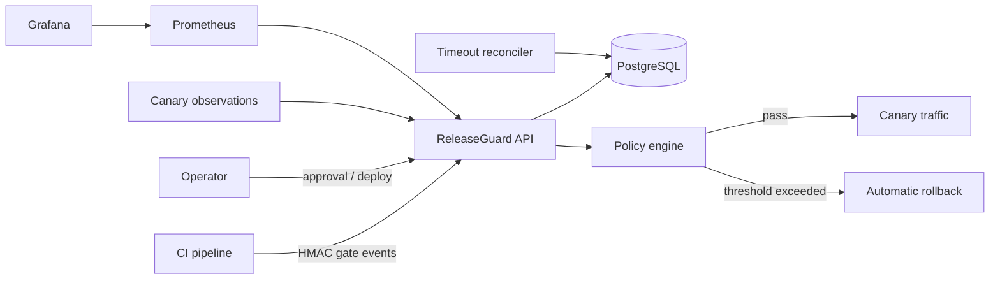

# ReleaseGuard architecture

## Invariants

- An environment has at most one active release. The environment row is locked
  with `FOR UPDATE` before a release reserves it.
- A release references an immutable `sha256:` artifact digest.
- CI webhooks are authenticated with HMAC-SHA256 and deduplicated by event ID.
- The state machine prevents direct `approved -> succeeded` transitions.
- Promotion requires every configured gate, optional human approval and healthy
  canary observations.
- A failed or timed-out canary restores the previous release reference.
- Every decision is appended to the release event journal.

## Failure handling

- Duplicate release request: same key and payload returns the original release;
  a changed payload returns `409`.
- Duplicate webhook: same event is ignored; reused ID with changed body returns `409`.
- Parallel deployment: the environment lock rejects the second active release.
- Missing canary metrics: reconciler rolls the release back after the timeout.
- API restart: state and audit history remain in PostgreSQL.

