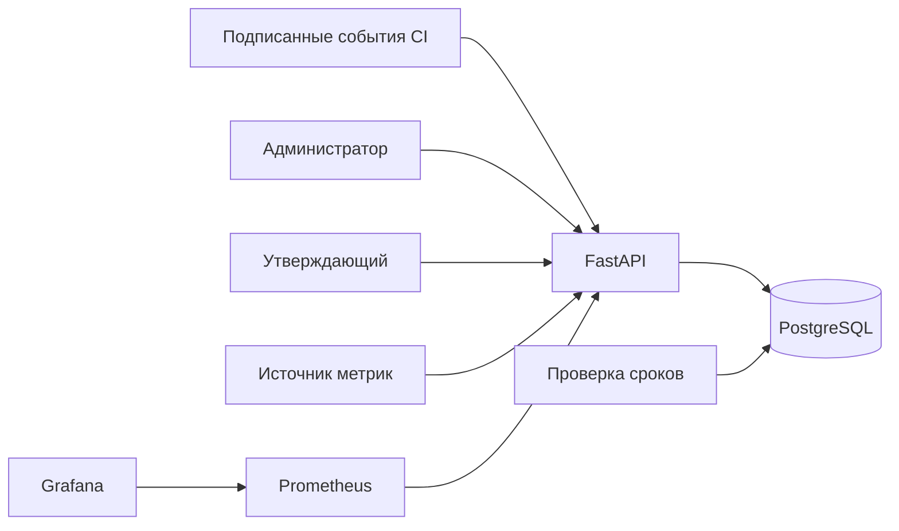

# Архитектура ReleaseGuard

```mermaid
flowchart LR
    CI[Подписанные события CI] --> API[FastAPI]
    Admin[Администратор] --> API
    Approver[Утверждающий] --> API
    Observer[Источник метрик] --> API
    API --> DB[(PostgreSQL)]
    Reconciler[Проверка сроков] --> DB
    Prometheus --> API
    Grafana --> Prometheus
```

## Доступ и аудит

Список клиентов и ролей задаётся в `API_CLIENTS`. Все управляющие маршруты требуют Bearer-ключ, а CI-уведомления — HMAC от исходного тела. Отсутствующий или недействительный ключ даёт `401`, неподходящая роль — `403`. Имя участника события выводится из настроенного ключа. Значение `actor` из тела запроса не используется. Администратор не может одновременно выступить утверждающим с тем же ключом.

Ключи находятся в окружении процесса. При использовании Terraform они также попадают в секрет Kubernetes и чувствительное состояние Terraform; доступ к этому состоянию следует ограничивать отдельно. Для множества пользователей и регулярной ротации ключей понадобится внешний сервис удостоверений.

## Согласованность

Создание релиза блокирует строку окружения до поиска существующего `idempotency_key` и записи нового релиза. Поэтому конкурентные повторы получают один ID, а независимый релиз не может занять уже зарезервированное окружение. Вебхук блокирует строку релиза, фиксирует `event_id` и результат проверки в одной транзакции. Повтор того же тела не создаёт события; другой результат проверки отклоняется.

Переходы состояния ограничены функцией доменной модели. Ручное утверждение, запуск, наблюдение и откат блокируют строку релиза; операции, меняющие привязку окружения, затем блокируют и его строку. Откат уже завершённого релиза допустим лишь пока он остаётся текущим и в окружении нет другого активного релиза. Так поздний запрос не вернёт окружение к старой версии. Сверка зависших релизов использует `SKIP LOCKED` и проверяет, что релиз всё ещё владеет окружением.

Метрика активных релизов вычисляется из PostgreSQL при сборе `/metrics`; перезапуск API не обнуляет её смысл. Остальные счётчики относятся к процессу API и при перезапуске начинают новую серию.

## Граница ответственности

Сервис хранит и проверяет решение о выпуске. Ни маршрут `/deploy`, ни смена `traffic_percent`, ни откат состояния не обращаются к Kubernetes, балансировщику или реальному приложению. Наблюдения отправляет доверенный клиент с ролью `observer`; автоматического сбора метрик из Prometheus сейчас нет. Поэтому код и тесты подтверждают согласованность решений, но не успешность реального развёртывания или восстановления трафика. Helm и Terraform разворачивают сам ReleaseGuard, а не управляемое им приложение.
